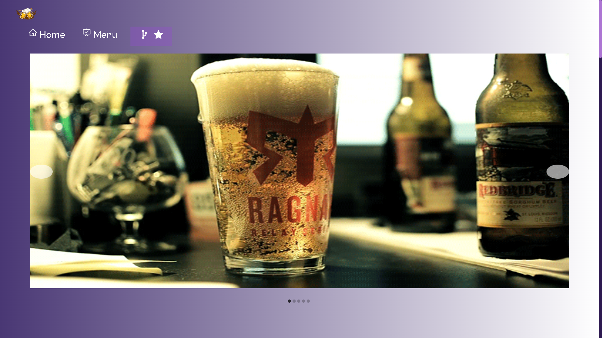
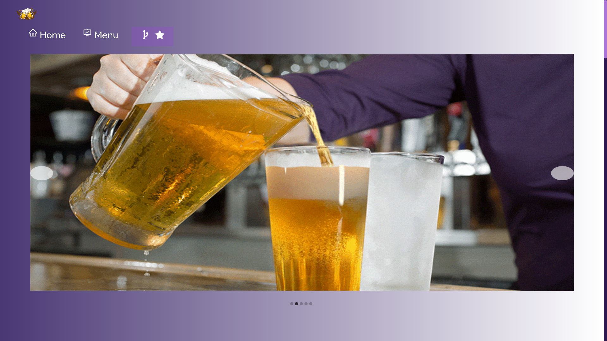
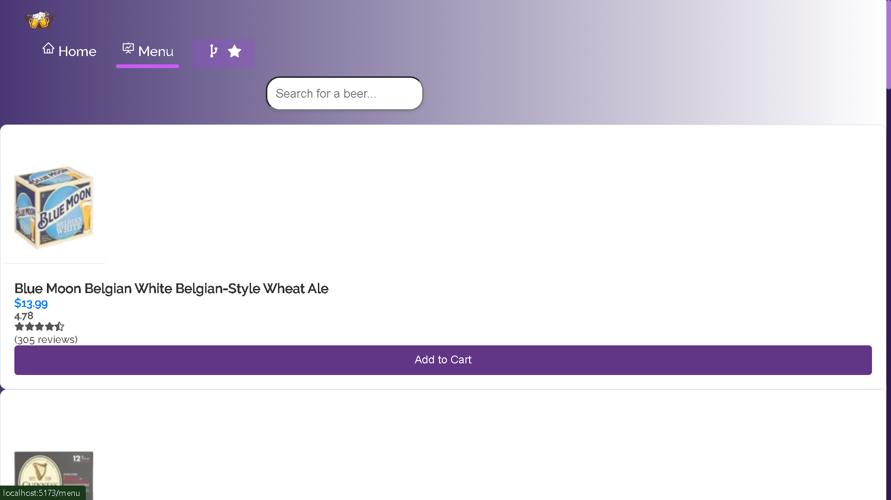
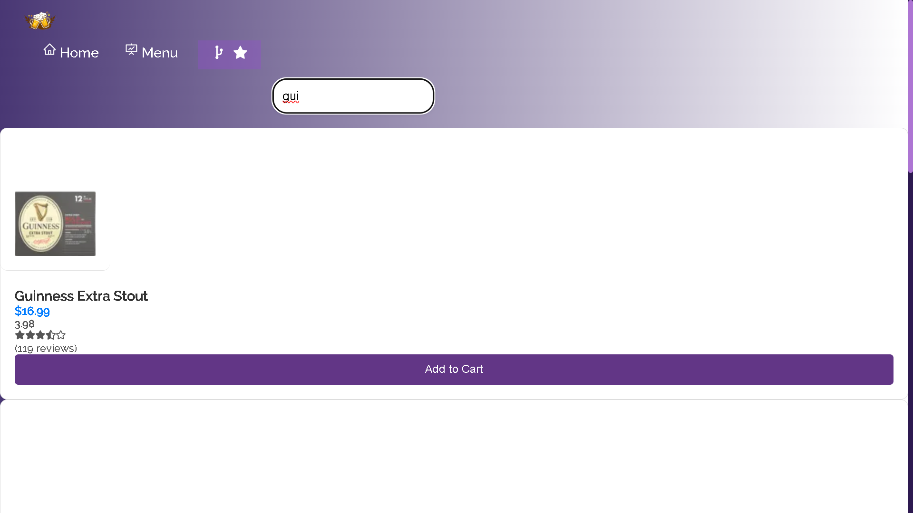

<h1 align="center">

<br>

<br>

<br>

REACT + VITE
## React app using data from https://api.sampleapis.com/beers/ale

Created a homepage with slideshow of beer images obtained from various sources such as
freepik, pexels, Pixabay, etc.
Created a Menu section with Search feature for finding beers from the https://api.sampleapis.com/beers/ale
api.Implemented parallel image loading and pagination for fasted image loading and filtering.
</h1>

## Technologies 🔧

- Next.js(React)
- TypeScript
- Prisma
- NextAuth
- Stripe
- Tailwind
- React Query
- Sentry
- Yup

## Screenshots 📸

<br>



<br>



<br>
<br>



<br>
<br>



<br>

## Code Example/Issues 🔍

If you have any issues, please let me know in the issues section or directly to vigneshr75021@gmail.com

## Installation 💾

```bash
git clone https://github.com/vickyax/Alew_Brewery.git
```


Install deps:

```bash
npm install
```

Run dev server:

```bash
npm run dev
```
